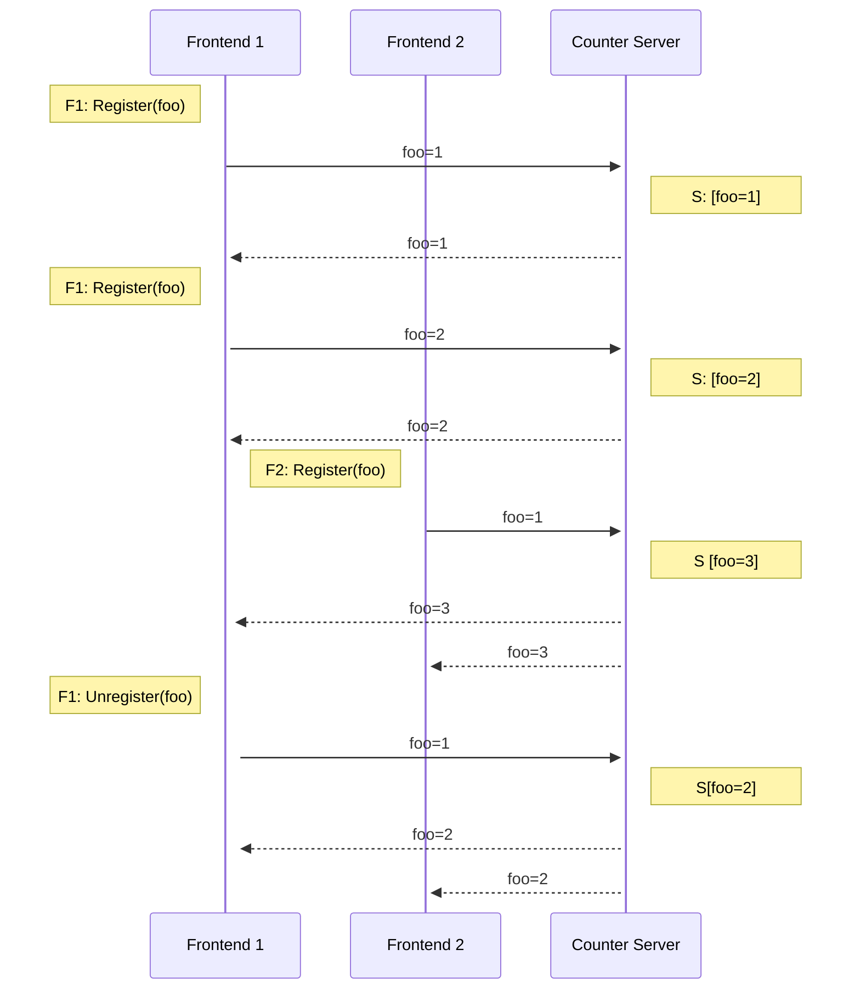

# Counter Service

> :warning: **Counter service is still in development**

The counter service is a demo cluster that shows how Fuddle can be used for
application specific routing between nodes, rather than just basic round robin
load balancing.

Users register an ID, then the service streams updates on how many other users
are registered with the same ID. So if a user registers ID `foo`, the service
will increment the count and broadcast the updated count to all users registered
with ID `foo`. Similarly when a user unregisters the count is decremented and
broadcast.

To scale the cluster horizontally, each node in the cluster is responsible for a
range of IDs using consistent hashing. Therefore Fuddle is used to build the
hash ring of nodes, and receive updates when nodes join and leave to trigger a
rebalance.

Although this is a simple service, it show how Fuddle can be used for:
* Observability: View the nodes in the cluster and their state either through
the Fuddle dashboard or using the Fuddle CLI,
* Cluster discovery: Nodes use Fuddle to discover each other, and are notified
when nodes join, leave or update their state, which can be used for routing
requests to the appropriate node

## Cluster
The cluster contains two types of nodes:

### Frontend Nodes
Frontends expose a WebSocket API for clients to connect to. These nodes are
stateless, and handle routing requests to the correct counter node.

When a request comes in to register for an ID, the frontend will lookup the
appropriate counter node, register with a gRPC stream, then forward count
updates to the WebSocket client.

When counter nodes join or leave the cluster, the frontend receives an update
from Fuddle and will rebalance to its counter service connections to ensure each
ID is registered with the correct node.

### Counter Nodes
Counter nodes aggregate the count for each ID. They expose a gRPC interface
which frontends connect to send send and receive counter updates.

Each node is responsible for a range of IDs using consistent hashing. The nodes
maintain their own view of the cluster using Fuddle, so if a frontend registers
an ID with the wrong node it will respond with an error, or if the counter nodes
join or leave, they will rebalance and return errors to any streams that are now
registered to the wrong node.

## Usage
If you haven’t already, download the `fuddle` binary for your platform from the
[releases](https://github.com/fuddle-io/fuddle/releases) page.

Then run `fuddle demo counter` to start the cluster. This will spin up a local
cluster containing multiple Fuddle, frontend and counter service nodes.

The Fuddle dashboard for the cluster can be viewed at
[http://127.0.0.1:8221](http://127.0.0.1:8221). Alternatively you can inspect
the cluster using `fuddle status cluster` or `fuddle status node {node ID}`.

  

Each frontend exposes a WebSocket endpoint at `ws://{addr}/{id}` to register an
ID and stream updates to the number of users registered with that ID.

To connect using [`wscat`](https://www.npmjs.com/package/wscat) use
`wscat -c ws://{addr}/{id}`.

## Architecture

### Counter Service Protocol
The section describes the protocol between the counter client, running on a
frontend, and a gRPC server running on a counter node.

The client maintains a local count of each ID, which is sent to the server
whenever it is updated, where the server aggregates the counts from each of its
connected clients and broadcasts the aggregate.

When a user registers an ID with the counter client:
1. The counter client checks if it already has a count for that ID
2. If it does have a count already, it increments the local count and sends it
to the server
3. Otherwise it will initialise a count of 1, connect to the appropriate server
for that ID and send the server an update
4. The server will receive the updated local count for the client, update its
aggregate, and broadcast the updated aggregate to all clients

Each client has at most one connection to each counter node, so updates with
different IDs may be sent on the same connection.

### Consistent Hashing
Each counter node maintains a counter for a range of IDs, which is done using
consistent hashing.

Note since this is just a demo, this implementation is relatively simple.

#### Partitioning
Each client maintains a partitioner, which receives the set of counter nodes
from Fuddle and builds a ring using MurmurHash3.

When a new ID is registered with a client, the client will lookup the correct
node for that ID with the partitioner.

#### Rebalancing
The partitioner will subscribe to Fuddle updates about the set of counter nodes
in the cluster.

Each counter on the client will subscribe to partitioner updates to get notified
when they need to move to a new counter node. When this happens they simply
disconnect from the current node, reconnect to the new node and send the local count.

This means when counters move nodes, the count will be briefly too low as nodes
move across, though since this is just a toy demo that's ok.

To keep the implementation simple, only the client checks whether the ring has
been updated. The server simply accepts any connections without checking if
they are connecting to the correct server.

