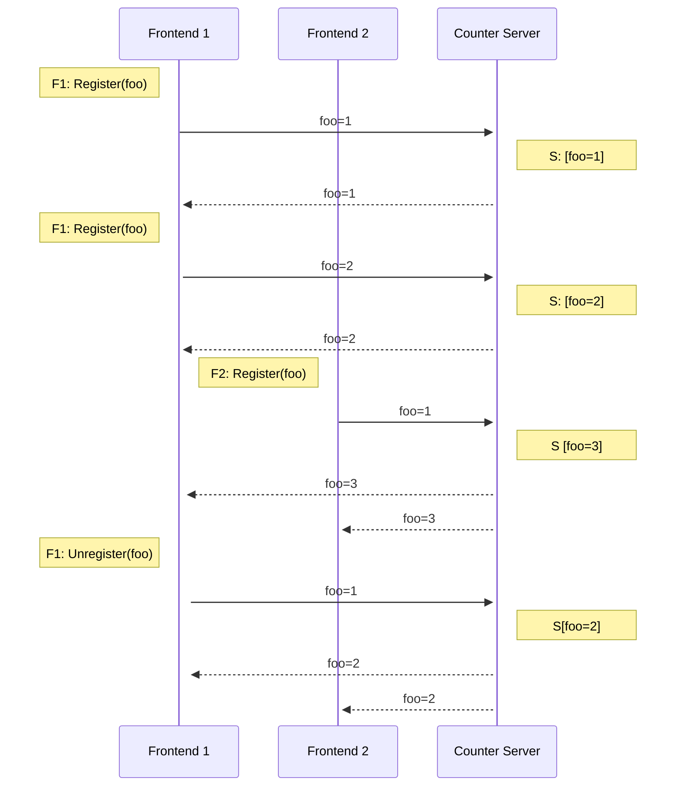

# Architecture

## Counter Service Protocol
This section describes the protocol used for counter clients to interact with a
counter server. This only describes sending and receiving counter updates, not
how consistent hashing is used to partition ID ranges.

The counter service client runs on frontend nodes. The client exposes a
`Register(id, onUpdate)` method and a method to unregister.

When a user registers with an ID, the client will update its local count
containing the number of users registered for that ID on the client. It will
then get a connection to the appropriate server given the ID, and send an update
to the server containing the ID and local count.

Note each client only maintains one connection and gRPC stream to each server.
So a single stream may have updates for multiple IDs.

The server receives updates from each connected client. Each update contains an
ID and the local count on the sending client for that ID. The server then
aggregates the total count and broadcasts the result to all connections
registered for that ID.

