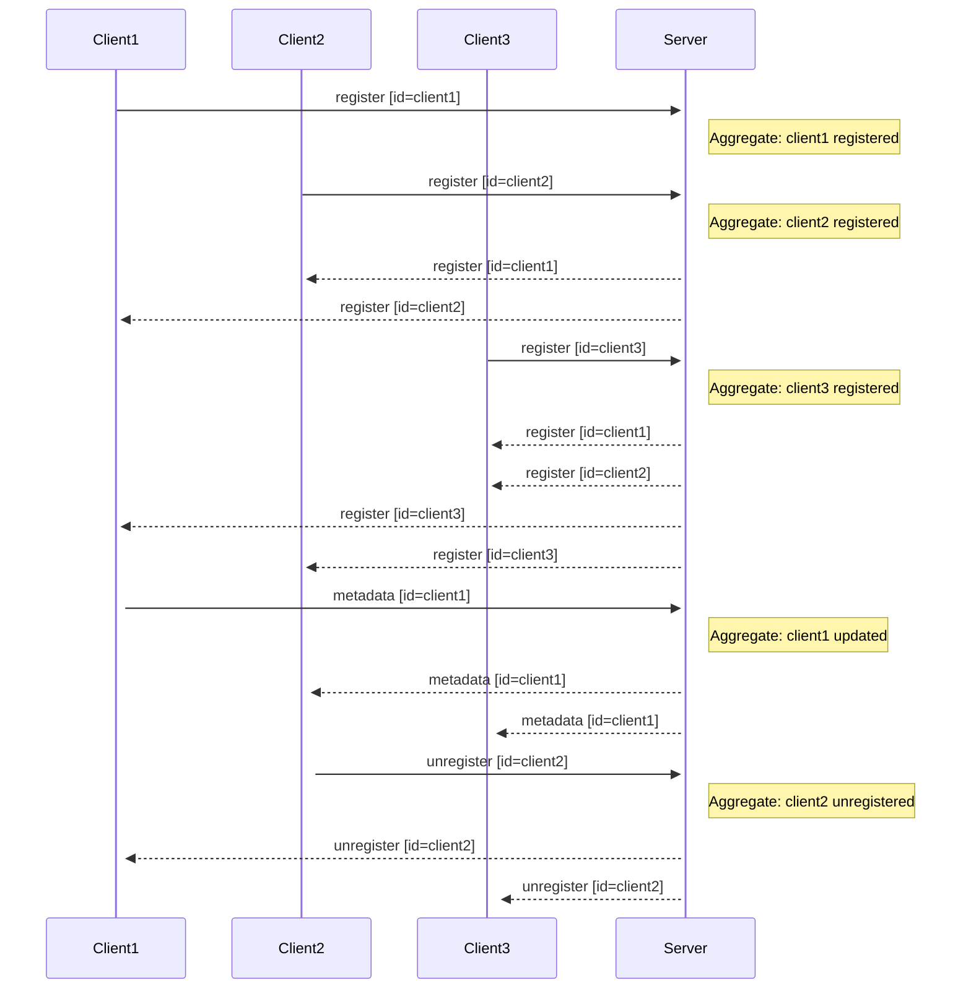

# Registry Protocol
This document describes the protocol between a registered node and a Fuddle
server.

The protocol is intentionally simple to get something working quickly, though
may improve later, such as moving to a gRPC API.

## Transport
Clients connect to the `/api/v1/register` WebSocket endpoint. Messages sent
are encoded as JSON.

## Message Format
Each message contains a `string` message type and a payload for that type.

Supported types:
* `node_update`: Describes an update to the client nodes entry in the registry

### `node_update`
A node update message describes an update to a nodes entry in the registry.

Each node update contains:
* Node ID (`string`): The registered nodes ID
* Update type (`string`): The type of update:
	* `register`: A node has joined the cluster
	* `unregister`: A node has left the cluster
	* `metadata`: A nodes metadata has changed
* Attributes: A nodes immutable attributes. Only sent when the node is
registered
* Metadata: The nodes application defined metadata, which are just string
key-value pairs. The contents of this field depend on the update type:
	* `register`: Contains all metadata fields
	* `unregister`: Empty since theres no need to update the metadata of a leaving
node
	* `metadata`: Contains only the key-value pairs that have been updated

Node attributes include:
* Service (`string`): The type of service running on the node
* Locality (`string`): The location of the node
* Created (`int64`): The UNIX timestamp in milliseconds that the node was
created
* Revision (`string`): An identifier for the version of the service running on
the node, such as a Git tag or commit SHA

## Protocol

### Node Register
Client send `node_update` messages to Fuddle when their local node changes:
* `register`: When the client first connects it sends a `register` update
including its nodes information
* `metadata`: When the client nodes metadata is updated, it is sent to update
its entry in the registry,
* `unregister`: When the client node is shutdown it sends an `unregister` to
gracefully remove itself from the registry

Once registered, each client streams the registry state and any future updates
to build its own eventually consistent view of the registry.

When the client is registered, the server will send a set of `register`
updates, each containing information on a node in the cluster. Once the client
is up to date, all further node updates sent to the Fuddle registry will be
forwarded to all connected clients.

